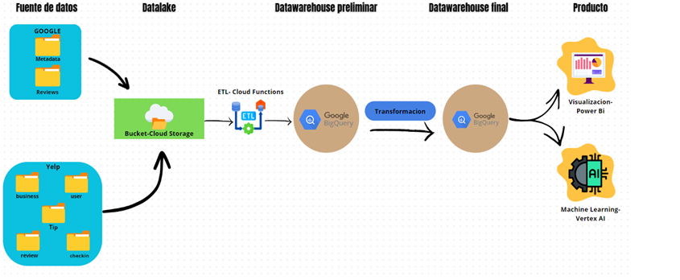
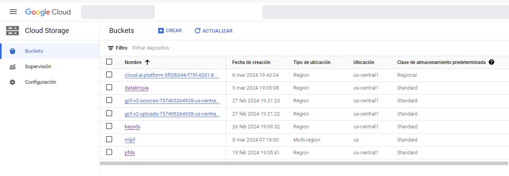
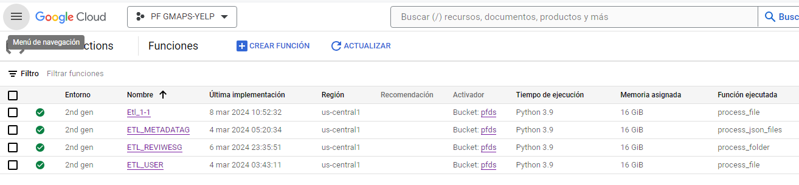
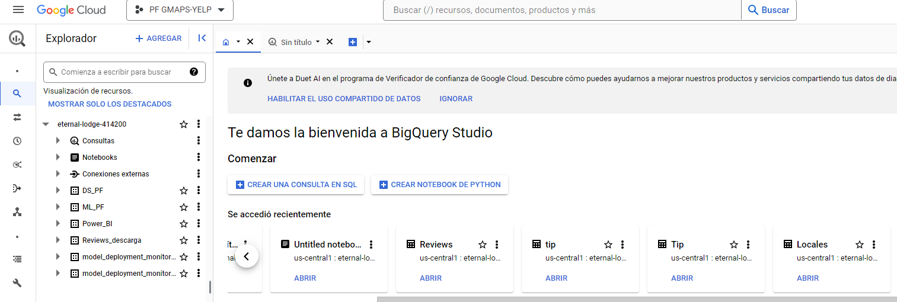
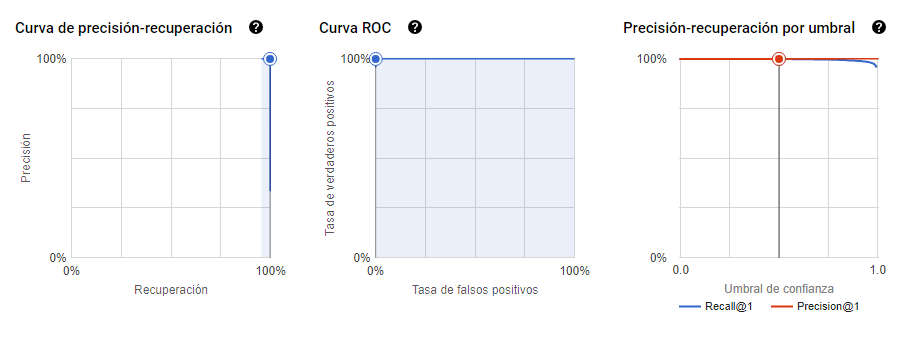
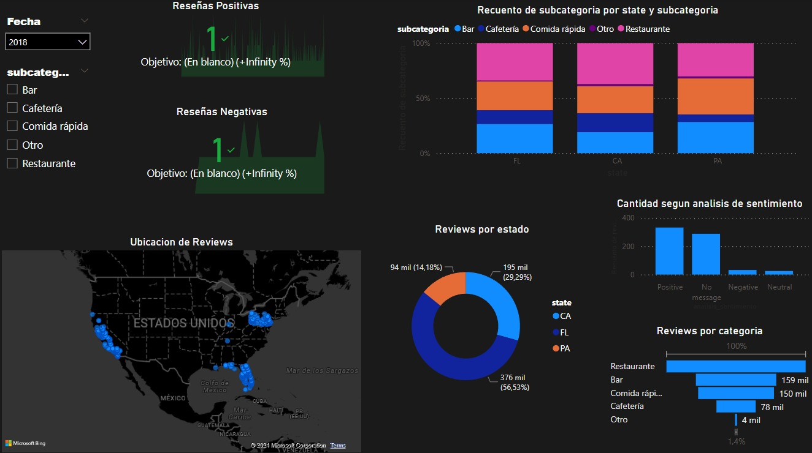

# PF_Data_Science

## CONTENIDO 
[ Cloud functions](https://github.com/PF-Data-Science/PF_Data_Science/tree/main/Cloud%20functions) : En esta carpeta se encuentra la muestra de las funciones implementadas dentro de *Cloud Functions* \
[ EDA Final](https://github.com/PF-Data-Science/PF_Data_Science/tree/main/EDA%20Final) : En la carpeta Se encuentra un archivo _.ipynb_  que muestra el analisis final de los datos ya limpios respecto a los objetivos planteados\
[ EDA/Google/Estados](https://github.com/PF-Data-Science/PF_Data_Science/tree/main/EDA/Google/Estados) : Dentro de esta carpeta se encuentra un Analisis Exploratorio preeliminar donde reconocemos los objetivos y el punto de inicio de nuestro proyecto\
[ ETL local](https://github.com/PF-Data-Science/PF_Data_Science/tree/main/ETL%20local) : Dentro de esta capeta se encuentra el codigo implemetado dentro de cada funcion de manera local sin usar los servicios de *GCP* \
[src]() : Dentro de *src* se encuentran los recursos para este archivo _.readme_ 

## Quiénes Somos

**DataMinds** Solutions es una empresa especializada en ofrecer servicios de consultoría en análisis de datos y toma de decisiones basada en información estratégica. Con un equipo altamente calificado, estamos comprometidos en brindar soluciones efectivas para satisfacer las necesidades específicas de nuestros clientes.

  

## Objetivo

Nuestro principal objetivo es proporcionar a nuestros clientes recomendaciones sólidas y respaldadas por datos. Utilizamos técnicas de Machine Learning y análisis predictivo para evaluar tendencias e identificar oportunidades. Nuestra misión es ofrecer a los inversionistas información precisa que les permita tomar decisiones fundamentadas y estratégicas. A través de modelos analíticos y la interpretación experta de datos, buscamos maximizar el rendimiento, adaptándonos a las necesidades específicas de cada cliente.

  

## Empresa Inversionista

Nos han contratado para realizar un análisis del mercado estadounidense. Nuestro cliente es parte de un conglomerado de empresas de restaurantes y afines, y desean tener un análisis detallado de la opinión de los usuarios en Yelp y cruzarlos con los de Google Maps sobre hoteles, restaurantes y otros negocios afines al turismo y ocio, utilizando análisis de sentimientos, predecir cuáles serán los rubros de los negocios que más crecerán (o decaerán). Además, desean saber dónde es conveniente emplazar los nuevos locales de restaurantes y afines, y desean poder tener un sistema de recomendación de restaurantes para los usuarios de ambas plataformas para darle, al usuario por ejemplo la posibilidad de poder conocer nuevos sabores basados en sus experiencias previas.

## Propuesta de Trabajo

Recopilar, depurar y disponibilizar la información: Creación de una base de datos (DataWarehouse) de diferentes fuentes tanto las dadas como externas (web scrapping), reporte de análisis y entrenamiento de modelo.

## Stack Tecnológico

  

|STACK|
-------
    Numpy |NLTK | Pandas |Scikit-learn | Python |MD | Jupyter Notebooks | GCP | Jira | Power Bi |GitHub |Git | Visual Studio| 
___
## PIPELINE 
dentro de nuestro pipe line comienza la extraccion de los datos para formar eun DataLake asi mediante GCP obtener nuestro DataWarehouse, Se realizan las ultimas transformaciones de los datos en 2 datasets distintos para realizar el modelo de ML y el dashboard de la presentacion. 

## ETL 

Se realizo la extraccion de los datos desde archivos en crudo con formato ".json" y ".parquet" cargando los archivos en un bucket dentro de Cloud Storage creando funciones de automatizacion dentro de Cloud Functions para realizar la limpieza y transformacion de los archivos para asi disponibilizar los datos dentro de Big Query. 

| Cloud Storage |  ||

| Cloud Functions | || 

| Big Query  | ||

link:[ Video carga incremental](https://youtu.be/YdyE4f0HODc?feature=shared)

## Vertex AI 
se utiliza la infraestructura ofrecida por Google cloud Platform "Vertex AI" para desarrollar, entrenar, evaluar y deployar el modelo de ML 
se utilizo la herramienta Auto ML 
Se creo un modelo de Clasificacion evaluado por las metricas proporcionas por la plataforma

   

ya implementado el modelo de ML se dispone de una aplicacion para crear recomendaciones tanto al cliente contratante realizando recomendaciones de inversión asi como a los consumidores reaizando recomendaciones de acuerdo lo que buscan en cuestion a restaurantes 

## Power BI 

se creo un dashboard interactivo donde se muestra la evaluacion final de los datos y algunos kpis implemetados

 

## Conclusiones Finales

* De acuerdo al analisis realizado podemos determinar que en los estados analizados prepondera mas el rubro de los restaurantes por lo tanto podria ser una buena opcion de inversion para nuestro cliente
* El estado com mayor cantidad de reseñas es el estado de pennsylvania teniendo en cuenta que dentro de todos los estados son restaurantes, Pennsylvania se recomendaria accerder al mercado de la comida rapida 
* dentro de california predomina el rubro de bar seria un buen sector a implemetar una inversion
 
___
## COLABORADORES 

| Puesto | Nombre | Usuario de GitHub |
| ------ | ------ | ----------------- |
| Data Analyst | Joshua Giovanni Esquivel Fuentes | JGIOVANNIE |
| Data Scientist | Nicolas Agustin Ibarra | nicovid-ibarra |
| Data ML Engineer | Sebastian Diaz Gaviria | Sebastiandiazgav |

